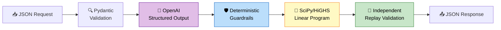
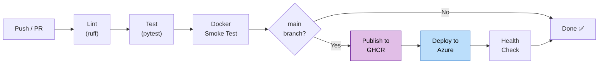

# ⚡ GridWise LLM Energy Optimizer

> **BUP CSE Fest 2026 — Smart Campus Energy Optimization Challenge**
> LLM-assisted operator directive interpretation with deterministic optimization

[](https://github.com/Sajibv1/gridwise-llm/actions/workflows/quality.yml)


| Project detail | Link / value |
| --- | --- |
| Team | **Infinity Loop SEU** |
| Live API | [gridwise-api-id.yellowocean-23e36385.indonesiacentral.azurecontainerapps.io](https://gridwise-api-id.yellowocean-23e36385.indonesiacentral.azurecontainerapps.io/) |
| Interactive docs | [Open Swagger UI](https://gridwise-api-id.yellowocean-23e36385.indonesiacentral.azurecontainerapps.io/docs) |
| Docker fallback | [`ghcr.io/sajibv1/gridwise-llm@sha256:80d85cf9e5dc9512ef146317ff31428c773915afdd4f95aa24f44b27bcb7dfb9`](https://github.com/Sajibv1/gridwise-llm/pkgs/container/gridwise-llm) |

---

## 📋 Table of Contents

- [Architecture](#-architecture)
- [How the LLM Is Used](#-how-the-llm-is-used)
- [Supported Directives](#-supported-operator-directives)
- [Local Quickstart](#-local-quickstart)
- [Environment Variables](#-environment-variables)
- [API Reference](#-api-reference)
- [Sample Request & Response](#-sample-request--response)
- [Testing & Public-Sample Validation](#-testing--public-sample-validation)
- [Docker Fallback Image](#-docker-fallback-image)
- [Deployment (Azure Container Apps)](#-azure-container-apps-deployment)
- [Project Structure](#-project-structure)
- [Security & LLM Guardrails](#-security--llm-guardrails)
- [Optimizer & Validity Guarantees](#-optimizer--validity-guarantees)
- [CI/CD Pipeline](#-cicd-pipeline)
- [Known Limitations](#-known-limitations)
- [Credits & Dependencies](#-credits--dependencies)

---

## 🏗 Architecture



| Stage | Module | Role |
|-------|--------|------|
| Request validation | `app/models.py` | Pydantic v2 with `extra="forbid"`, finite checks, 24-hour horizon enforcement |
| LLM interpretation | `app/interpreter.py` | OpenAI Structured Outputs — interprets operator notes **only** |
| Deterministic guardrails | `app/directives.py` | Validates type, hours, numeric ranges, applies semantics, exact shape |
| LP optimization | `app/optimizer.py` | SciPy `linprog` with HiGHS — minimizes `Σ(grid_kwh × tariff)` |
| Replay verification | `app/replay.py` | Independent re-check of every constraint before responding |
| API orchestration | `app/main.py` | FastAPI with safe error handling, no secret leakage |

> The LLM **never** chooses the schedule, calls tools, or directly modifies the optimizer. Its output is treated as untrusted until deterministic code verifies every field.

---

## 🤖 How the LLM Is Used

The LLM is **mandatory** and is part of the operator-note interpretation path — not used merely for `plan_summary` or documentation.

| Aspect | Detail |
|--------|--------|
| **Provider** | OpenAI API |
| **Model** | Pinned `gpt-5.4-mini-2026-03-17` with `low` reasoning effort |
| **Output mode** | Strict JSON-schema structured output (`"strict": true`) |
| **Input** | Battery capacity + operator notes as quoted untrusted data |
| **Output** | One `LLMDirectiveCandidate` per note in `note_index` order |
| **What it does NOT do** | Choose schedules, call tools, access files/network, see API keys |
| **Repair policy** | If schema-valid but semantically invalid, one bounded repair attempt; then rejection |

The system prompt:
- Lists all 6 directive types with exact adjustment shapes
- Specifies `factor` = usable fraction remaining (80% reduction → `0.2`)
- Specifies start-inclusive, end-exclusive time windows
- Includes calibration examples for paraphrases, whole-hour time windows, and percentage interpretation
- Instructs the model to treat operator notes as quoted data (prompt injection defense)

---

## 📜 Supported Operator Directives

| Type | `structured_adjustment` | Example |
|------|------------------------|---------|
| `solar_reduction` | `{"hours": [13,14], "factor": 0.2}` | "80% solar reduction 1–3 PM" |
| `minimum_battery_reserve` | `{"hours": [18,19,20], "minimum_energy_kwh": 120}` | "Keep 120 kWh reserve 6–9 PM" |
| `no_charge_window` | `{"hours": [14,15]}` | "Don't charge battery 2–4 PM" |
| `no_discharge_window` | `{"hours": [2,3,4]}` | "No battery discharge 2–5 AM" |
| `max_grid_window` | `{"hours": [18,19], "max_grid_kwh": 100}` | "Limit grid to 100 kWh 6–8 PM" |
| `no_op` | `null` | "Cafeteria menu changes tomorrow" |

- All time windows are **start-inclusive, end-exclusive** (1 PM to 3 PM → `[13, 14]`)
- Solar `factor` is the **usable fraction remaining** (80% reduction = `factor: 0.2`)
- `no_op` requires `applies = false` and `structured_adjustment = null`

---

## 🚀 Local Quickstart

**Prerequisites:** Python 3.12+, an OpenAI API key with access to a structured-output-capable model.

```bash
# 1. Clone and install
git clone https://github.com/Sajibv1/gridwise-llm.git
cd gridwise-llm
python3 -m pip install --user -r requirements.txt

# 2. Configure (put your key in .env only — never commit it)
cp .env.example .env
# Edit .env and set OPENAI_API_KEY=sk-...

# 3. Start the service
uvicorn app.main:app --host 0.0.0.0 --port 8000
```

In another terminal:

```bash
# 4. Verify health
curl http://localhost:8000/health
# Expected: {"status":"ok"}

# 5. Run all 10 public sample cases
python scripts/verify_public_samples.py http://localhost:8000

# 6. Run paraphrase robustness tests
python scripts/verify_semantic_paraphrases.py http://localhost:8000
```

---

## 🔧 Environment Variables

| Variable | Required | Default | Description |
|----------|----------|---------|-------------|
| `OPENAI_API_KEY` | **Yes** | — | OpenAI API key (via `.env` or Azure secret ref) |
| `OPENAI_MODEL` | No | `gpt-5.4-mini-2026-03-17` | Evaluated, pinned model snapshot |
| `OPENAI_REASONING_EFFORT` | No | `low` | GPT-5.4 Mini reasoning effort (`none`, `low`, `medium`, `high`, or `xhigh`) |
| `LLM_TIMEOUT_SECONDS` | No | `7` | Maximum seconds per model call (range: 1–7) |
| `LLM_MAX_RETRIES` | No | `0` | Deliberately fixed at zero: SDK retries may honor a long provider `Retry-After` |
| `LLM_SEMANTIC_RETRIES` | No | `1` | Repair attempts after local directive validation rejects schema-valid model output (range: 0–1) |
| `LOG_LEVEL` | No | `INFO` | Python logging level |

> **⚠️ Never commit real API keys.** `.env` is in `.gitignore`. Use `.env.example` as a template.

---

## 📡 API Reference

Interactive Swagger UI: [`/docs`](https://gridwise-api-id.yellowocean-23e36385.indonesiacentral.azurecontainerapps.io/docs)
OpenAPI spec: [`/openapi.json`](https://gridwise-api-id.yellowocean-23e36385.indonesiacentral.azurecontainerapps.io/openapi.json)

### `GET /health`

Returns HTTP 200 and `{"status":"ok"}` once the service is ready. Does not call the LLM.

### `POST /optimize-energy`

Accepts the challenge request schema and returns the full optimization response.

| Status | Meaning |
|--------|---------|
| `200` | Successful optimization with replay-validated plan |
| `400` | Malformed JSON or structurally invalid request |
| `422` | Valid structure but infeasible under validated constraints |
| `500` | Controlled internal error (no secrets, stack traces, or raw provider output) |

---

## 📝 Sample Request & Response

### Request

```bash
curl -X POST http://localhost:8000/optimize-energy \
  -H "Content-Type: application/json" \
  -d '{
    "scenario_id": "DEMO-001",
    "operator_notes": [
      "Only 20% of forecast solar will be usable from 1 PM until 3 PM.",
      "The cafeteria menu changes tomorrow."
    ],
    "hours": [
      {"hour": 0, "demand_kwh": 180, "solar_kwh": 0, "tariff_bdt_per_kwh": 7},
      {"hour": 1, "demand_kwh": 180, "solar_kwh": 0, "tariff_bdt_per_kwh": 7},
      {"hour": 2, "demand_kwh": 180, "solar_kwh": 0, "tariff_bdt_per_kwh": 7},
      {"hour": 3, "demand_kwh": 180, "solar_kwh": 0, "tariff_bdt_per_kwh": 7},
      {"hour": 4, "demand_kwh": 180, "solar_kwh": 0, "tariff_bdt_per_kwh": 7},
      {"hour": 5, "demand_kwh": 180, "solar_kwh": 0, "tariff_bdt_per_kwh": 7},
      {"hour": 6, "demand_kwh": 180, "solar_kwh": 0, "tariff_bdt_per_kwh": 7},
      {"hour": 7, "demand_kwh": 180, "solar_kwh": 0, "tariff_bdt_per_kwh": 7},
      {"hour": 8, "demand_kwh": 180, "solar_kwh": 50, "tariff_bdt_per_kwh": 7},
      {"hour": 9, "demand_kwh": 180, "solar_kwh": 80, "tariff_bdt_per_kwh": 7},
      {"hour": 10, "demand_kwh": 180, "solar_kwh": 100, "tariff_bdt_per_kwh": 7},
      {"hour": 11, "demand_kwh": 180, "solar_kwh": 110, "tariff_bdt_per_kwh": 7},
      {"hour": 12, "demand_kwh": 180, "solar_kwh": 120, "tariff_bdt_per_kwh": 9},
      {"hour": 13, "demand_kwh": 180, "solar_kwh": 110, "tariff_bdt_per_kwh": 9},
      {"hour": 14, "demand_kwh": 180, "solar_kwh": 100, "tariff_bdt_per_kwh": 9},
      {"hour": 15, "demand_kwh": 180, "solar_kwh": 80, "tariff_bdt_per_kwh": 9},
      {"hour": 16, "demand_kwh": 180, "solar_kwh": 50, "tariff_bdt_per_kwh": 9},
      {"hour": 17, "demand_kwh": 180, "solar_kwh": 0, "tariff_bdt_per_kwh": 9},
      {"hour": 18, "demand_kwh": 200, "solar_kwh": 0, "tariff_bdt_per_kwh": 11},
      {"hour": 19, "demand_kwh": 200, "solar_kwh": 0, "tariff_bdt_per_kwh": 11},
      {"hour": 20, "demand_kwh": 200, "solar_kwh": 0, "tariff_bdt_per_kwh": 11},
      {"hour": 21, "demand_kwh": 180, "solar_kwh": 0, "tariff_bdt_per_kwh": 9},
      {"hour": 22, "demand_kwh": 180, "solar_kwh": 0, "tariff_bdt_per_kwh": 7},
      {"hour": 23, "demand_kwh": 180, "solar_kwh": 0, "tariff_bdt_per_kwh": 7}
    ],
    "battery": {
      "capacity_kwh": 500,
      "initial_energy_kwh": 200,
      "minimum_energy_kwh": 50,
      "max_charge_kwh_per_hour": 100,
      "max_discharge_kwh_per_hour": 100
    }
  }'
```

### Response (abbreviated, produced by the live endpoint)

```json
{
  "scenario_id": "DEMO-001",
  "directive_interpretation": [
    {
      "note_index": 0,
      "applies": true,
      "directive_type": "solar_reduction",
      "structured_adjustment": {"hours": [13, 14], "factor": 0.2},
      "explanation": "Solar usability is reduced during the stated afternoon window."
    },
    {
      "note_index": 1,
      "applies": false,
      "directive_type": "no_op",
      "structured_adjustment": null,
      "explanation": "Unrelated to the energy schedule."
    }
  ],
  "hourly_plan": [
    {"hour": 0, "grid_kwh": 280.0, "solar_used_kwh": 0.0, "battery_action": "charge", "battery_kwh": 100.0, "battery_energy_after_kwh": 300.0},
    "... 22 more hourly entries ...",
    {"hour": 23, "grid_kwh": 280.0, "solar_used_kwh": 0.0, "battery_action": "charge", "battery_kwh": 100.0, "battery_energy_after_kwh": 200.0}
  ],
  "total_grid_kwh": 3748.0,
  "total_cost_bdt": 29072.0,
  "peak_grid_kwh": 280.0,
  "plan_summary": "Applied 1 operator directive(s) after deterministic validation; optimized grid cost is 29072.00 BDT with peak grid use 280.00 kWh."
}
```

---

## 🧪 Testing & Public-Sample Validation

```bash
# Run the full test suite (all 10 public cases, guardrails, injection defense, schema checks)
pytest

# Verify against the live endpoint
python scripts/verify_public_samples.py http://localhost:8000

# Test paraphrase robustness
python scripts/verify_semantic_paraphrases.py http://localhost:8000
```

**What the tests cover:**

| Test | What it validates |
|------|-------------------|
| `test_every_public_case_replays_and_matches_optimal_cost` | All 10 public cases: interpretation, optimization, replay, cost match |
| `test_guardrail_rejects_out_of_order_or_unsafe_model_output` | Deterministic rejection of invalid LLM output |
| `test_guardrail_rejects_prompt_injection_as_a_non_directive` | Prompt injection → safe `no_op` classification |
| `test_provider_schema_forbids_open_ended_adjustment_objects` | `additionalProperties` never `true` in LLM schema |
| `test_health_and_public_sample_contract` | `/health` response + full API contract validation |
| `test_invalid_request_is_http_400` | Malformed input returns 400, not 500 |
| Semantic-repair tests | Exactly one repair attempt on local directive-validation failure; no retry loop |
| `test_openapi_documentation_has_descriptions_and_a_valid_request_example` | Swagger UI completeness |

CI runs lint (`ruff check` + `ruff format --check`), all tests, and a Docker `/health` smoke test on every push and PR via `.github/workflows/quality.yml`.

---

## 🐳 Docker Fallback Image

### Pull and run the published image

```bash
docker pull ghcr.io/sajibv1/gridwise-llm@sha256:80d85cf9e5dc9512ef146317ff31428c773915afdd4f95aa24f44b27bcb7dfb9
docker run --rm -p 8000:8000 \
  -e OPENAI_API_KEY=sk-your-key-here \
  -e OPENAI_MODEL=gpt-5.4-mini-2026-03-17 \
  -e OPENAI_REASONING_EFFORT=low \
  -e LLM_TIMEOUT_SECONDS=7 \
  -e LLM_MAX_RETRIES=0 \
  -e LLM_SEMANTIC_RETRIES=1 \
  ghcr.io/sajibv1/gridwise-llm@sha256:80d85cf9e5dc9512ef146317ff31428c773915afdd4f95aa24f44b27bcb7dfb9
```

### Build and test locally

```bash
docker build -t gridwise-llm:local .
docker run --rm -p 8000:8000 --env-file .env gridwise-llm:local

# Verify
curl http://localhost:8000/health
# {"status":"ok"}
```

**Image properties:**
- Base: `python:3.12-slim`
- Non-root user (`appuser`, UID 10001)
- Exposes port `8000`, binds to `0.0.0.0`
- No baked-in secrets or `.env` file (excluded via `.dockerignore`)
- Tested in CI before every deployment

---

## ☁️ Azure Container Apps Deployment

The service runs on Azure Container Apps in Indonesia Central with `min-replicas: 1` (no cold start).

```bash
# One-time: create the environment
az containerapp env create \
  --name gridwise-fest-id-env \
  --resource-group gridwise-fest-rg \
  --location indonesiacentral

# Deploy (script reads API key interactively, stores as Azure secret)
ENVIRONMENT=gridwise-fest-id-env \
APP_NAME=gridwise-api-id \
IMAGE=ghcr.io/sajibv1/gridwise-llm@sha256:80d85cf9e5dc9512ef146317ff31428c773915afdd4f95aa24f44b27bcb7dfb9 \
  bash deploy/azure-containerapp.sh

# Update image after testing
az containerapp update \
  --name gridwise-api-id \
  --resource-group gridwise-fest-rg \
  --image ghcr.io/sajibv1/gridwise-llm:NEW_TAG
```

The deploy script:
- Reads the API key without echoing it
- Stores it as an Azure Container Apps secret reference
- Starts 1 minimum replica (avoids cold-start during judging)
- Prints the public HTTPS hostname

---

## 📁 Project Structure

```
gridwise-llm/
├── app/
│   ├── main.py              # FastAPI app, endpoints, error handling
│   ├── models.py            # Pydantic request/response schemas
│   ├── interpreter.py       # OpenAI LLM integration (isolated)
│   ├── directives.py        # Deterministic guardrails + constraint compilation
│   ├── optimizer.py         # SciPy/HiGHS linear program
│   ├── replay.py            # Independent schedule verification
│   └── config.py            # Environment-based settings
├── tests/
│   ├── test_api.py           # API contract, health, error handling tests
│   └── test_directives_and_optimizer.py  # All 10 public cases + guardrail tests
├── scripts/
│   ├── verify_public_samples.py          # Live endpoint verification
│   └── verify_semantic_paraphrases.py    # Paraphrase robustness tests
├── deploy/
│   ├── azure-containerapp.sh             # Azure deployment script
│   └── bootstrap-github-oidc.sh          # One-time OIDC setup
├── docs/
│   ├── submission-checklist.md
│   └── video-outline.md
├── .github/workflows/
│   ├── quality.yml            # CI: lint → test → Docker smoke → deploy
│   └── publish-image.yml      # Tagged release → GHCR
├── Dockerfile
├── requirements.txt
├── pyproject.toml
├── .env.example
└── .gitignore                 # .env excluded
```

---

## 🔒 Security & LLM Guardrails

| Protection | Implementation |
|-----------|---------------|
| **Prompt injection defense** | Operator notes are quoted untrusted data; system prompt forbids following in-note instructions |
| **No tool access** | LLM has no tools, file access, network actions, or secrets |
| **Strict JSON schema** | `"strict": true` prevents free-form output from the model |
| **Deterministic validation** | Every field checked post-LLM: type, hours order, numeric ranges, exact shape |
| **Secret handling** | `SecretStr` for API key, `.env` gitignored, no secrets in logs/responses/images |
| **Safe error responses** | All errors return generic messages — no stack traces, no provider internals |
| **Non-root Docker** | Container runs as `appuser` (UID 10001) |

---

## 📐 Optimizer & Validity Guarantees

**Objective:** `minimize Σ(grid_kwh[h] × tariff_bdt_per_kwh[h])` for h = 0..23

**Constraints enforced in the LP:**
- Energy balance: `grid + solar + discharge = demand + charge` (every hour)
- Effective solar: `solar_used ≤ solar_kwh × solar_factor[h]`
- Battery transitions: `E[h] = E[h-1] + charge[h] - discharge[h]`
- Battery bounds: `min_reserve[h] ≤ E[h] ≤ capacity`
- Rate limits: `charge ≤ max_charge`, `discharge ≤ max_discharge`
- Directive constraints: no-charge/no-discharge windows, grid caps
- End-of-day neutrality: `E[23] = initial_energy`

**Double verification:** Before every response, `replay.py` independently recalculates all constraints and aggregate values within the 0.01 kWh/BDT tolerance. If replay fails, the response is rejected (HTTP 500) — the service never returns an invalid plan.

---

## 🔄 CI/CD Pipeline



- **OIDC authentication** — no Azure passwords or client secrets stored
- **Immutable digest deployment** — deployed by SHA digest, not mutable tag
- **Concurrency control** — newer push cancels older in-flight deploy
- **Post-deploy health check** — verifies the public endpoint after every release

---

## ⚠️ Known Limitations

1. **LLM provider dependency** — requires a hosted OpenAI-compatible API to be available, funded, and within quota during judging.
2. **Single provider adapter** — the architecture deliberately isolates the LLM integration in `app/interpreter.py` so a compatible provider can be substituted without changing safety checks or optimization logic.
3. **Public samples ≠ hidden cases** — public samples serve as regression tests but do not guarantee robustness against unseen paraphrases in hidden cases.

---

## 🙏 Credits & Dependencies

| Dependency | Purpose | License |
|-----------|---------|---------|
| [FastAPI](https://fastapi.tiangolo.com/) | HTTP API framework | MIT |
| [Pydantic v2](https://docs.pydantic.dev/) | Request/response validation | MIT |
| [OpenAI Python SDK](https://github.com/openai/openai-python) | LLM structured output | Apache 2.0 |
| [SciPy](https://scipy.org/) | HiGHS LP solver | BSD |
| [NumPy](https://numpy.org/) | Numerical computation | BSD |
| [Uvicorn](https://www.uvicorn.org/) | ASGI server | BSD |
| [pytest](https://pytest.org/) | Test framework | MIT |
| [ruff](https://github.com/astral-sh/ruff) | Linter and formatter | MIT |

AI coding assistants were used during development. Core architecture and logic are the team's own work.

---

*Built for BUP CSE Fest 2026 — Dept. of CSE, BUP*
